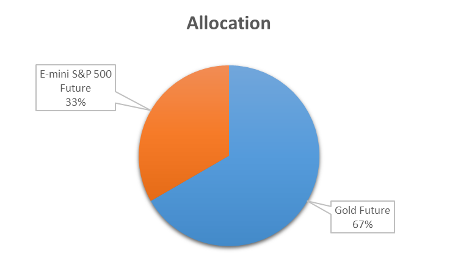

Market Positions & Trading
==========================

A unique attribute of the Quantiacs toolbox is the use of market exposure rather than trades. Instead of telling the system to buy and sell a certain number of stocks or futures contracts, you can allocate your available assets and choose how much market exposure you want in a specific stock/future. This is done by adjusting an array ``p`` and returning/outputing it from your trading system function. In order to figure out how big your market exposure is, Quantiacs looks at all your positions and allocates your capital proportionally. The position vector is normalized to an absolute sum of 1, so each ``p`` value is evaluated proportionally to every other position value.

+--------+-------------------------------------------------+
| p = 0  | you don't hold asset i in your portfolio        |
+--------+-------------------------------------------------+
| p >= 0 | you are invested long in asset i with weight p  |
+--------+-------------------------------------------------+
| p < 0  | you are invested short in asset i with weight p |
+--------+-------------------------------------------------+

Below is a code example of setting the positions for futures:

.. code-block:: matlab

	settings.markets =  {'F_GC', 'F_ES'};
	% your trading algorithm
	p = [2.4, -1.2]

Here is an example, let's say your capital is set to $1,000,000 in settings (see :ref:`settings-label` section), and you decide to buy Gold (F_GC) and sell the S&P 500 (F_ES). Let's say you set your ``p`` vector to 2.4 in the market column representing Gold and to -1.2 for S&P 500, and take no other positions. Then the system would take your $1 million capital, and allocate it proportionally to the market exposure you just set above. In other words, 2x the capital would go towards going long Gold as it would short the S&P 500. Your market exposure in Gold would become 2.4/3.6 * 10^6 = $666,667 and our negative short position in S&P 500 would become 1.2/3.6 * 10^6 = $333,333. Then whatever your returns are the next day, your balance and market exposure would adjust accordingly (assuming the positions remained the same at 2.4 and 1.2). This representation of market exposure isn't 100% accurate of the real world, where you would have to buy and sell discrete amounts of contracts, but for large balances it should average out to roughly the same performance.

	Market allocation.

All of this is done behind the scenes. You can see the result in **equity** and can track your chosen market exposure positions in **exposure**.
